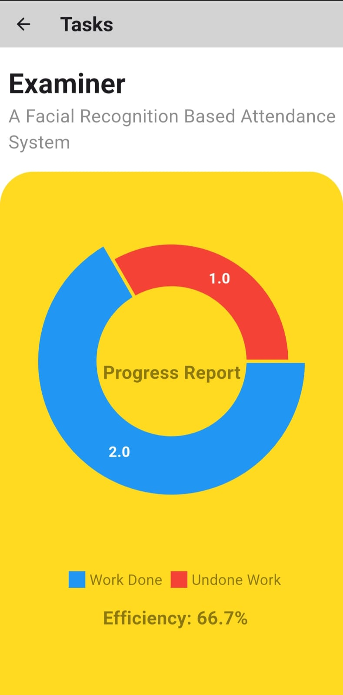

# ProManage

ProManage is a project management app that helps users manage their projects and tasks efficiently. Users can sign up, log in, and keep track of multiple projects with tasks and deadlines. The app features task completion tracking, progress reports, and project search functionality.

## Features

- **User Authentication:** Sign up and log in to manage your tasks and projects.
- **Project Management:** Add, update, and delete multiple projects.
- **Task Management:** Create tasks with deadlines for specific projects, mark tasks as done or undone.
- **Progress Tracking:** View progress charts showing completed and uncompleted tasks.
- **Search Functionality:** Easily search for projects.

## Screenshots

<table>
  <tr>
    <td style="text-align:center">
      
      <p style="text-align:center">SplashScreen</p>
    </td>
    <td style="text-align:center">
      
      <p style="text-align:center">Sign In</p>
    </td>
    <td style="text-align:center">
      
      <p style="text-align:center">Sign Up</p>
    </td>
  </tr>
  <tr>
    <td style="text-align:center">
      
      <p style="text-align:center">Home Screen</p>
    </td>
    <td style="text-align:center">
      
      <p style="text-align:center">Task Screen</p>
    </td>
    <td style="text-align:center">
      
      <p style="text-align:center">Project Report</p>
    </td>
  </tr>
  <tr>
    <td style="text-align:center">
      
      <p style="text-align:center">Search Screen</p>
    </td>
  </tr>
</table>

## Installation

1. Clone the repository:
    ```bash
    git clone https://github.com/Imran-Chowdhury/Project-Management-App
    ```
2. Navigate to the project directory:
    ```bash
    cd Project-Management-App
    ```
3. Install dependencies:
    ```bash
    flutter pub get
    ```

4. Run the app:
    ```bash
    flutter run
    ```

## Technologies Used

- **Flutter:** UI Framework
- **Django & MySQL:** Backend for user authentication, project, and task management


## Contribution

Feel free to open issues or create pull requests to contribute to the project.


